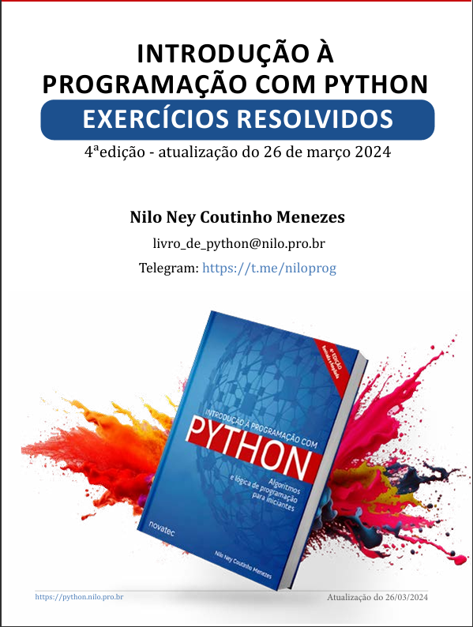

# Exercícios: Introdução à Programação com Python

Este diretório contém as resoluções dos exercícios baseados no livro:

  

### Créditos
* **Livro:** Introdução à Programação com Python (Algoritmos e Lógica de Programação para Iniciantes).
* **Edição:** 4ª edição - atualizada em 26 de março de 2024.
* **Autor:** Nilo Ney Coutinho Menezes.
* **Mais informações:** [nilo.pro.br](https://nilo.pro.br)